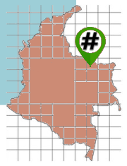
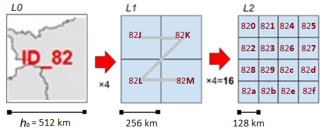

# OSM.Codes Colombia

Sumario:

* [Presentación](#presentación)

  * [Proyección adoptada y origen](#proyección-adoptada-y-origen)

  * [Códigos jerárquicos](#códigos-jerárquicos)

  * [Códigos abreviados (mnemotécnicos)](#códigos-abreviados-mnemotécnicos)

* [Decisiones abiertas y consensuadas](#decisiones-abiertas-y-consensuadas)

## Presentación

**Un geocódigo es un identificador único de una entidad geográfica** (ubicación u objeto) que permite distinguirla de otras en un conjunto finito de entidades geográficas. Entre los códigos geográficos más populares se encuentran los [códigos de país y sus subdivisiones](https://es.wikipedia.org/wiki/ISO_3166-1_alfa-2) y los [códigos postales](https://es.wikipedia.org/wiki/Anexo:C%C3%B3digos_postales_de_Colombia).

Los geocódigos también se pueden asociar con un **sistema de cuadrícula discreto, que utiliza un mosaico jerárquico de celdas de áreas iguales para representar la superficie de la tierra**. Como cada celda representa una unidad espacial con un identificador de referencia único, este sistema puede reducir las consultas espaciales multidimensionales complejas en procesos de matriz unidimensionales, lo que **permite una integración de datos y cálculos rápidos y precisos**.

Esta aplicación de geocódigos es, por lo tanto, un **método computacionalmente eficiente para codificar coordenadas geográficas en un identificador corto**. Cuando se asocia con el contexto local, este código podría referirse a una propiedad rural (~ 15 m) con menos dígitos que el código postal. Con una resolución más baja (~ 3 m), también se puede hacer referencia a cualquier dirección urbana.

El proyecto OSM.Codes propone un sistema de cuadrícula discreto adaptado al contexto local de cada país. La propuesta de OSM.Codes Colombia se basa en los avances del mismo [proyecto en aplicación en Brasil](https://github.com/osm-codes/BR_IBGE_new).

### Proyección adoptada y origen

Esto proyecto adopta el [Sistema de Proyección Único para Colombia](https://origen.igac.gov.co/index.html), según la resolución 471 de 2020 del IGAC. En Colombia la proyección cartográfica oficial, se basa en una proyección Transversa de Mercator TM, usando un cilindro transverso como superficie de referencia y secante a la esfera. Este sistema prioriza ángulos (conforme), garantizando así que un ángulo formado entre dos líneas sobre la superficie terrestre se conserve luego de aplicarse la proyección. Los demás parámetros fueron seleccionados cuidadosamente de modo que, se cubriese todo el territorio continental, se evite el uso de coordenadas negativas y con un factor de escala k=0,9992 se optimizó que las distorsiones en la representación de área fuesen mínimas ([ABC Nueva projección cartográfica para Colombia](https://origen.igac.gov.co/docs/ABC_Nueva_Proyeccion_Cartografica_Colombia.pdf)).

Esta proyección cumple con los objetivos del proyecto, ya que permite generar una superficie de cuadrícula de igual superficie. La siguiente figura compara las cuadrículas regulares generadas con el Sistema de proyección única para Colombia (negro) y WGS84 (rojo).

Los parámetros del origen de la proyección se pueden utilizar como punto de centrado de la cuadrícula: LATITUD_O = 4.0 ° N y LONGITUD_O = 73.0 ° W.

### Códigos jerárquicos

Las celdas de un [sistema de cuadrícula discreta](https://en.wikipedia.org/wiki/Discrete_global_grid) (global o de un solo país) se pueden identificar de manera única por sus coordenadas de matriz ij, o por un solo número, llamado identificador.

Para proporcionar un **sistema de geocodificación jerárquico y compacto**, adoptamos el [algoritmo Geohash generalizado](https://ppkrauss.github.io/Sfc4q/), que se basa en la partición uniforme y recurrente de celdas cuadriláteras en 4 subcélulas, indexándolas por la curva de Morton.

Na ilustração utilizamos a  que permite representar células de grades de todos os níveis. Quando a grade tem 16¹=16  células, 16²=256 células ou outra potência de 16, sem grades intermediárias, pode-se adotar a convenção hexadecimal, ou seja, onde os dígitos seguem a sequẽncia 0-9, A-F.  Quando a representação precisa ser mais compacta, pode-se adotar a representação base32, ou seja, onde cada dígito pode ter 32 valores diferentes.

En la ilustración usamos [*base16h*](https://ppkrauss.github.io/Sfc4q) ([fundamentación](http://addressforall.org/_foundations/art1.pdf)), que nos permite representar celdas de cuadrícula de todos los niveles. Cuando la cuadrícula tiene 16¹=16 celdas, 16²=256 celdas u otra potencia de 16, sin cuadrículas intermedias, se puede adoptar la convención hexadecimal &mdash; es decir, donde los dígitos siguen la secuencia 0-9 y A-F. Cuando la representación necesita ser más compacta, se puede adoptar la representación [*base32*](https://en.wikipedia.org/wiki/Base32), es decir, donde cada dígito puede tener 32 valores diferentes.

### Códigos abreviados (mnemotécnicos)

Para una mayor compresión, es necesario establecer un contexto o representación mnemotécnica del contexto, por ejemplo a través del apodo (acrónimo) de la ciudad:

Una de las funciones de codificación / decodificación implementadas de la propuesta es la que da "abreviatura de contexto" al gecode propuesto.

## Decisiones abiertas y consensuadas

La decisión principal ya ha sido cuidadosamente tomada por el IGAC, reforzando las convenciones indicados en la tabla 1 a través de la [Resolucion IGAC 471 de 2020](https://igac.gov.co/sites/igac.gov.co/files/normograma/resolucion_471_de_2020.pdf). La ilustración del lateral muestra cómo el sistema adoptado redujo las distorsiones en la representación de área al mínimo.

Otra decisión cuidadosamente tomada, por los matemáticos, fue la adopción de poderes de 2 para cada nivel jerárquico de la cuadrícula, a partir del nivel cero &mdash; nivel inicial del "conjunto de cobertura" de Colombia y su mar territorial. <!-- 1141748/262 = 16 -->

Pero varias otras decisiones **están abiertas, para ser discutidas y votadas por entidades colombianas**:

1. ¿Usar la cuadrícula para múltiples propósitos?   Es decir, tanto para aplicaciones en Estadística y visualización de datos, como para aplicaciones logísticas, incluido el código postal.

2. ¿Utiliza la unidad de **1&#160;m** como referencia?   podría ser, por ejemplo, 100&#160;m o 1&#160;km (la decisión afectaría la elección de la cobertura).

3. ¿Ofrece solo una opción de *base* o dos opciones?  Por ejemplo, base32 para código postal y base16h para aplicaciones estadísticas.

4. ¿Usar el alfabeto Geohash en minúsculas (`0123456789bcdefghjkmnpqrstuvwxyz`) ou mayúsculas *No Vogal except U*, NVU (`0123456789BCDFGHJKLMNPQRSTUVWXYZ`)?  

5. ¿Indexación por [Curva de Hilbert](https://es.wikipedia.org/wiki/Curva_de_Hilbert) o [Curva de Morton](https://en.wikipedia.org/wiki/Z-order_curve)?

6.  ... otras decisiones.

Discutir en  https://github.com/osm-codes/CO_new/issues
